# lab7web
Raihan syahwal
312110362
TI.21.B.1
## langkah 1
install XAMPP
## langkah 2 
Jalankan program tersebut kemudian tekan tombol Start pada menu Apache seperti berikut.

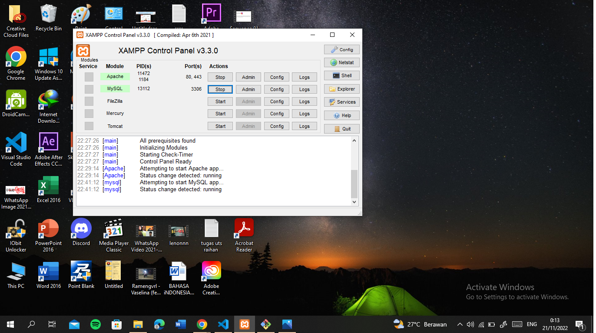
## langkah 3
Buatlah folder lab7_php_dasar pada directory web server (C:\xampp\htdocs) dan untuk mengakses directory tersebut pada web server dengan mengakses URL: http://localhost/Lab7_php_dasar/ seperti berikut.

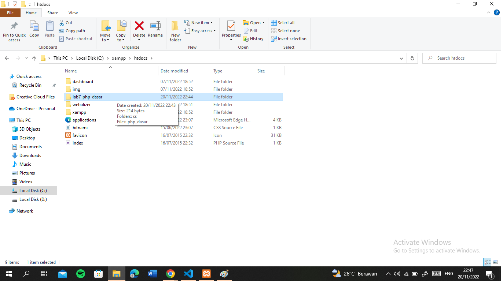
dan buat file php 

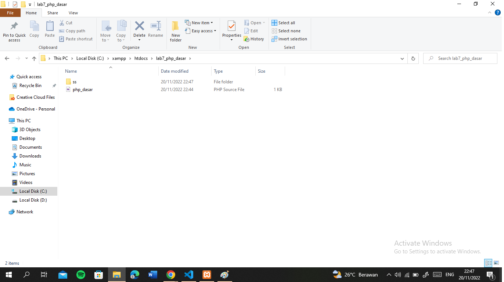
hasil

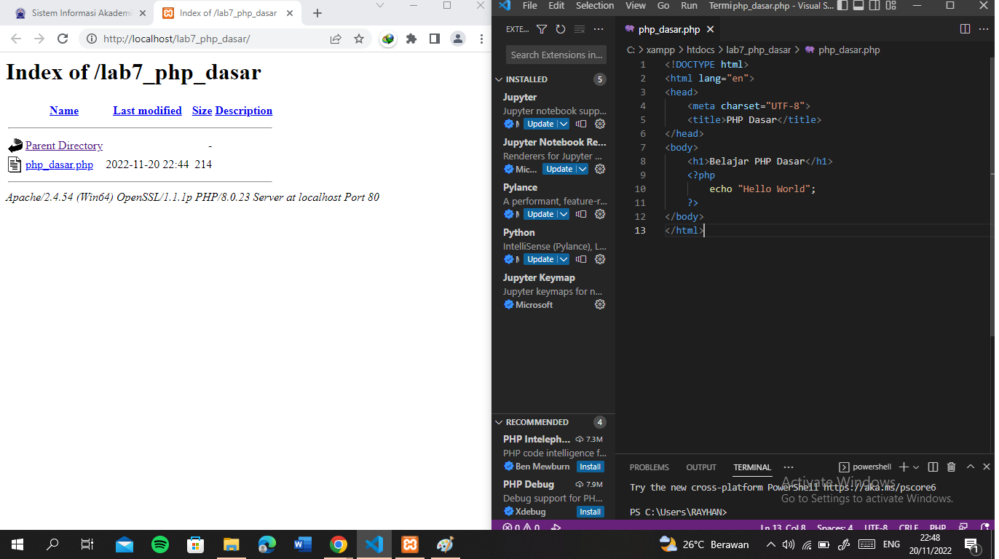
## langkah 4
Buatlah file baru dengan nama php_dasar.php pada directory tersebut. Kemudian untuk mengakses hasilnya melalui URL: http://localhost/Lab7_php_dasar/php_dasar.php

dan menambahkan variable 

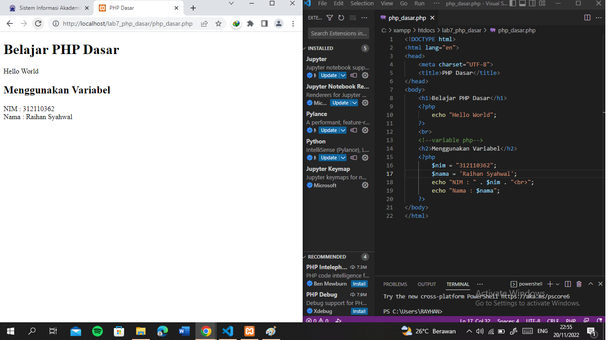
## langkah 5
Predefine Variable $_ GET
Menambahkan kode pada program seperti berikut. Kemudian untuk mengaksesnya gunakan URL : http://localhost/Lab7_php_dasar/php_dasar.php?nama=raihansyahwal

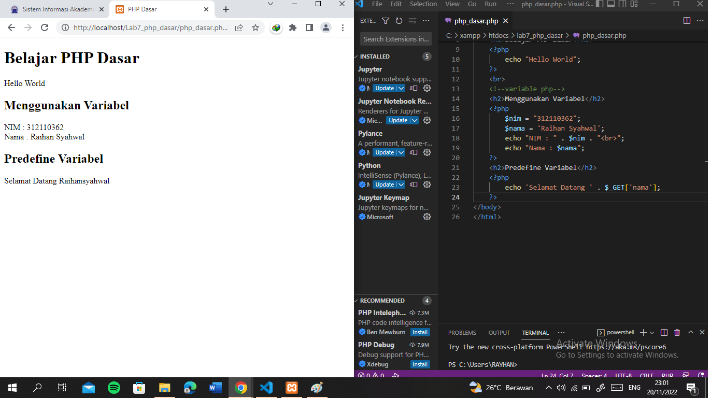
## langkah 6
membuat form input
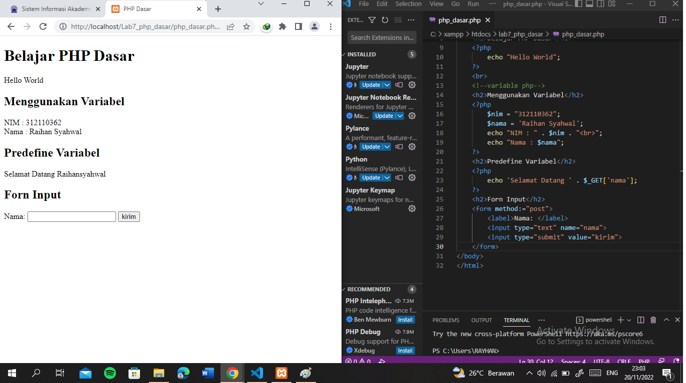
## langkah 7
kondisi operator
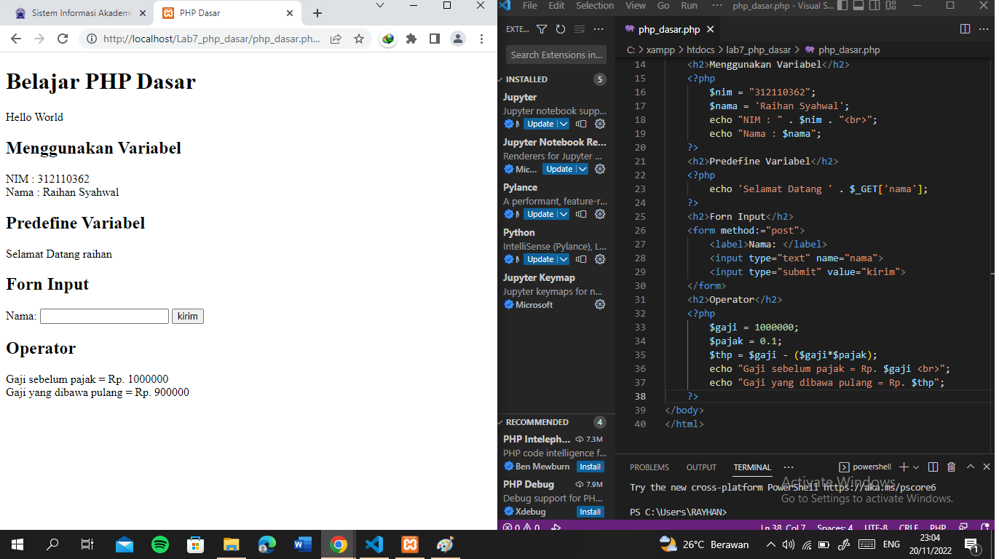
## langkah 8
kondisi if
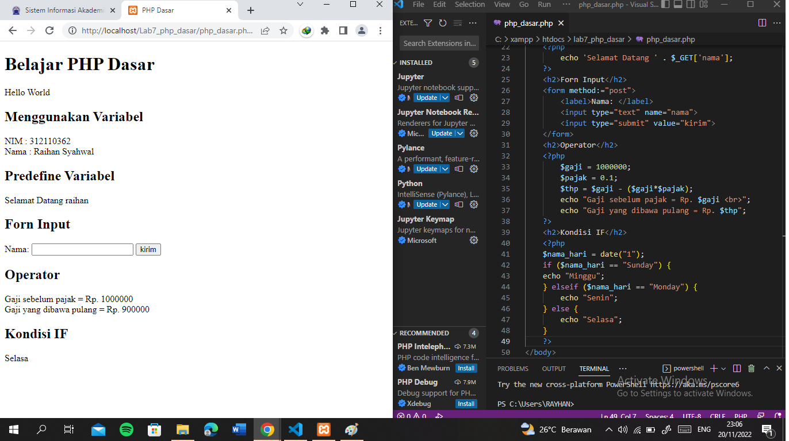
## langkah 9
kondisi switch

## langkah 10
perulangan for
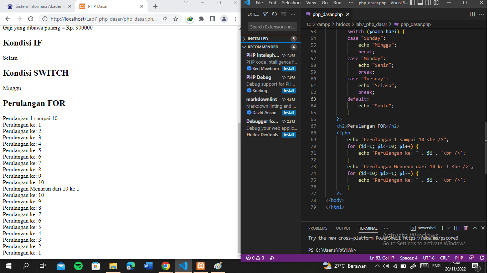
## langkah 11
perulangan while
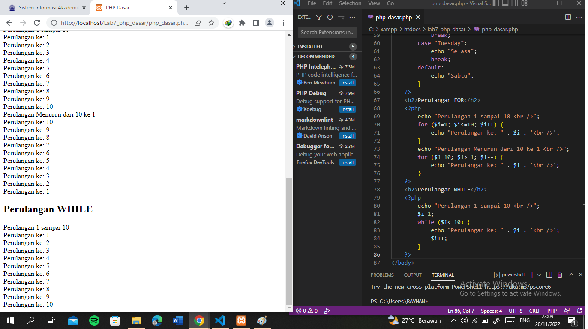
## langkah 12
perulangan downhile 
program ada pada file 
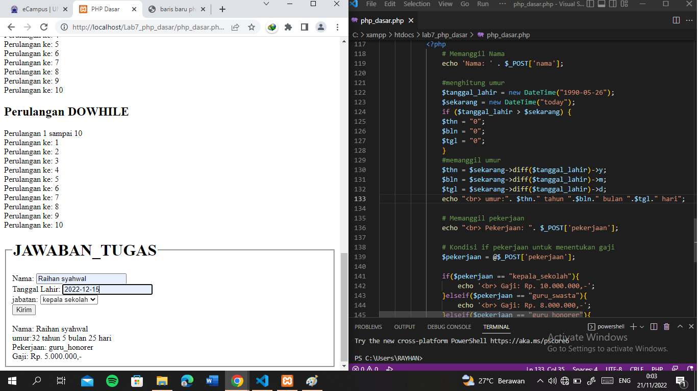
### tugas 
jawaban tugas 
